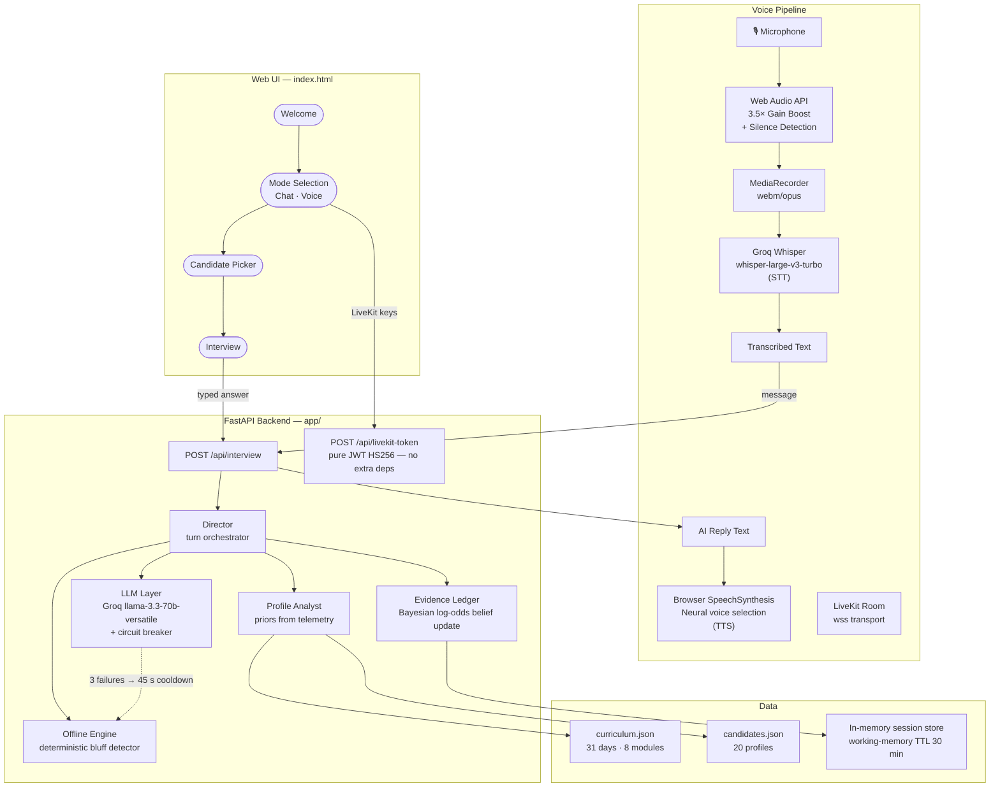

# ABTalks Interview Agent

**A panel of agents that forms explicit beliefs about a candidate, then interviews to test them.**

Most AI interviewers are a system prompt around a chat box. They pick a question,
read the answer, pick another. They have no model of the candidate, so they
cannot be surprised by one.

This one works the other way round. Before it asks anything it reads the
candidate's cohort telemetry and commits to a **number** for every interviewable
day: how likely is it that this person actually understands this material. The
interview is then a search — each question goes to whichever belief it is least
certain about and most cares to resolve. At the end it shows what it thought
before, what it thinks now, and which answer changed its mind.

---

## The thing it can do that a scripted interviewer cannot

Harold Whitfield, Distinguished Engineer, 28 years. His record shows he skipped
both fine-tuning days and needed five attempts at MCP. His job title claims
production expertise the record does not support.

The panel seeds that as a belief, probes it, and watches it fall:

```
day 27  Security, Privacy & Guardrails   0.90 ↓ 0.64  overclaimed
day 28  Docker & Kubernetes Deployment   0.90 ↓ 0.64  overclaimed
day 24  Agentic Chatbot Integration      0.72 ↓ 0.34  overclaimed
```

Emily Chen, AI Engineer, 31/31 missions all first try — the opposite result,
from the same machinery:

```
day  7  Embeddings Explained             0.94 → 0.80  confirmed-strength
day 13  Function Calling & Structured    0.94 → 0.90  confirmed-strength
day 15  Hands-On with LoRA & QLoRA       0.70 ↓ 0.54  overclaimed   ← she skipped it
```

---

## Architecture



---

## Quick start

```bash
python -m venv .venv && .venv\Scripts\activate && pip install -r requirements.txt
```

```bash
copy .env.example .env
```

Put a `GROQ_API_KEY` in `.env` (free tier is fine). Then:

```bash
uvicorn app.api:app --reload --port 8000
```

Open <http://localhost:8000>. Pick a candidate and talk to it.

Terminal instead of a browser:

```bash
python scripts/live_check.py CAND-008 bluff
```

```bash
pytest -q
```

### No API key? It still runs.

Without `GROQ_API_KEY` the whole interview works on a deterministic engine that
scores answers from real textual features. Not a stub — it is why the demo
cannot be killed by a rate limit mid-judging. Force it with `OFFLINE_ONLY=true`.

---

## The contract

One endpoint, exactly as specified.

```
POST /api/interview
```

```json
{ "sessionId": "abc-123", "candidate": { "member": {}, "missions": [], "signals": {} } }
```

```json
{ "sessionId": "abc-123", "message": "We tuned ef_search from 64 to 128..." }
```

Replies are `{"reply": "...", "done": false}` until the interview ends, then
`done: true` with `feedback: {summary, strengths[], gaps[], next[]}`.

Everything the console renders — ledger, calibration, agent trace — rides in an
extra `insight` key that an evaluator can ignore entirely.

`reply` is always plain speakable prose: no markdown, no bullets, no code
fences. That is a **voice** constraint applied to the text path so the same
string works in both transports without a rewrite.

---

## How it decides what to ask

```
gain(claim) = H(belief) × stakes × decay(probes) × source_bonus
```

`H` is binary entropy, so uncertainty peaks at 0.5 — the panel is pulled towards
what it genuinely does not know. Beliefs move in **log-odds**, so a strong answer
shifts a 0.5 belief a long way and a 0.95 belief barely at all, the same
asymmetry a human interviewer has.

Four rules override the maths where the maths is wrong:

| Rule | Why |
|---|---|
| **Verify the boast** | A role-implied claim at 0.9 has almost no entropy, so gain would never probe it — yet an unverified claim is the most expensive thing to leave in a report. |
| **Coverage lock** | Breadth is a hard floor, not a preference. If questions are running out, an unvisited day beats a juicier one. |
| **No verdict on one answer** | A high-stakes claim stays `probing` until two independent turns agree. |
| **Recovery, capped** | Two weak answers triggers a step down — but capped and never back to back, or the interview stops assessing and starts consoling. |

## Reading the data correctly

Two properties of the supplied files will silently corrupt an interview:

**`modules[].days` is a range.** `[7, 10]` means 7, 8, 9, 10. Reading it as a
membership list loses days 8 and 9.

**The mission list is a sample.** Sarah lists 10 missions but
`missionsCompleted: 30`. Treating an unlisted day as a gap would fabricate ~20
false weaknesses per candidate. Four states, not two:

```
passed:true   → observed success (weighted by attempts)
passed:false  → observed FAILURE — the loudest signal available
skipped:true  → deliberate avoidance
absent        → UNOBSERVED. Say nothing.
```

The two files also disagree on titles (curriculum day 21 is *"Agentic
Frameworks: LangChain Agents & Tool Use"*, the candidate file calls it
*"LangChain Agents"*). Everything joins on **day number**, never title.

---

## Retrieval

Agentic RAG, following Ebbelaar's `ai-cookbook/knowledge/agentic-rag`: no vector
store. The corpus is 31 short, exhaustively-titled documents where *"day 8 is
Vector Databases"* is an exact fact — embedding it and retrieving approximately
can only lose information. `app/knowledge.py` exposes search / read / list over
the curriculum **and** the candidate's record, so the interviewer can
cross-reference the two on its own initiative.

---

## Layout

```
app/
  models.py      wire contract — the only file that knows the spec
  normalize.py   ranges, four-state missions, tolerant loading
  ledger.py      belief update + interview policy
  profile.py     telemetry → priors, role-implied claims
  knowledge.py   agentic RAG over curriculum + record
  llm.py         Groq via LCEL, offline fallback, speakability
  offline.py     deterministic scorer incl. the bluff detector
  director.py    turn() — the single entry point
  api.py         POST /api/interview
  prompts/       chat templates + few-shot
web/index.html   console UI
tests/           49 tests
```

## Status

49 tests passing. Rubric floors (≥8 questions, ≥4 distinct days) asserted
against varied profiles including the sparse one, plus hostile input.

**Voice is live.** Browser mic → Web Audio 3.5× gain → MediaRecorder → Groq Whisper STT
→ `director.turn()` → Browser SpeechSynthesis (neural voice selection) + LiveKit room transport.
No Cartesia, no Deepgram — only a Groq key and LiveKit credentials.
